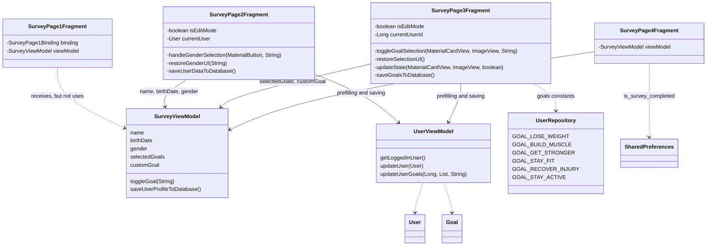

# Survey Module

## 1. General Description
The survey collects the user data after the first application running and it consists of 4 screens (fragments).
Also, the 2nd and 3rd screens can be used again in the "Edit Mode" (isEditMode), when the user changes his data.

| Screen | Class                 | ViewBinding | Purpose                                                                   |
|--------|-----------------------|---|---------------------------------------------------------------------------|
| 1      | `SurveyPage1Fragment` | `SurveyPage1Binding` | Welcoming, continue next button                                           |
| 2      | `SurveyPage2Fragment` | `SurveyPage2Binding` | Name, Date of Birth, Gendre                                               |
| 3      | `SurveyPage3Fragment` | `SurveyPage3Binding` | Trainings goals (6 cards + own goal)                                      |
| 4      | `SurveyPage4Fragment` | `SurveyPage4Binding` | Finalising: saving the profile to DB and redirect to home page (calendar) |

Packet: `com.example.fitnesscalendar.logic.survey`

---

## 2. Files and connections
Key idea: **all screens utilise one common `SurveyViewModel`**, which is linked to Activity (`new ViewModelProvider(requireActivity())`).
While the user switches the screens, the data is stored there, only after pressing the button in the end or **Save** in edit mode the new data is written in the DB.

