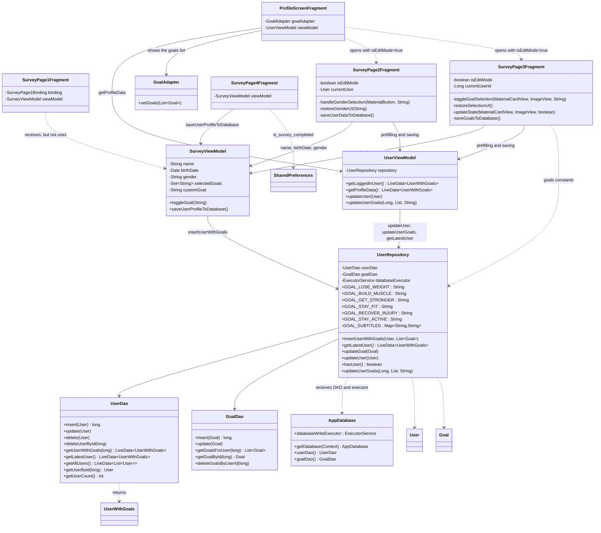
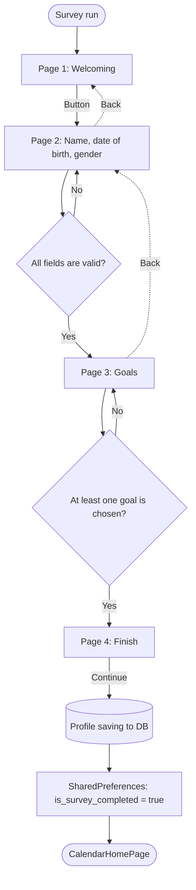

# Survey Module

## 1. General Description
The survey collects the user data after the first application running, and it consists of 4 screens (fragments).
Also, the 2nd and 3rd screens can be used again in the "Edit Mode" (isEditMode), when the user changes his data.

| Screen | Class                 | ViewBinding | Purpose                                                                   |
|--------|-----------------------|---|---------------------------------------------------------------------------|
| 1      | `SurveyPage1Fragment` | `SurveyPage1Binding` | Welcoming, continue next button                                           |
| 2      | `SurveyPage2Fragment` | `SurveyPage2Binding` | Name, Date of Birth, Gendre                                               |
| 3      | `SurveyPage3Fragment` | `SurveyPage3Binding` | Trainings goals (6 cards + own goal)                                      |
| 4      | `SurveyPage4Fragment` | `SurveyPage4Binding` | Finalising: saving the profile to DB and redirect to home page (calendar) |

Packet: `com.example.fitnesscalendar.logic.survey`

---

## 2. Files and connections
Key idea: **all screens utilise one common `SurveyViewModel`**, which is linked to Activity (`new ViewModelProvider(requireActivity())`).
While the user switches the screens, the data is stored there, only after pressing the button in the end or **Save** in edit mode the new data is written in the DB.

# Navigation between the screens
The transitions are described in navigation graph through actions:

| From where | To where         | Action                                   |
|------------|------------------|------------------------------------------|
| Page 1     | Page 2           | `action_SurveyPage1_to_SurveyPage2`      |
| Page 2     | Page 3           | `action_SurveyPage2_to_SurveyPage3`      |
| Page 3     | Page 4           | `action_SurveyPage3_to_SurveyPage4`      |
| Page 4     | CalendarHomePage | `action_SurveyPage4_to_CalendarHomePage`  (с `popUpTo`)|

The button Back calls navigateUp() on the 2 and 3 screens. The button Back in absent on the 4th screen.

For transition to `CalendarHomePage` is used `setPopUpTo(R.id.SurveyPage1, true)`. This removes all survey screens (including the first) from the stack.

---

## 4. Two modes: onboarding and edit
The screens 2 and 3 read argument `isEditMode` from `getArguments()` (false by default)

|                         | Onboarding (`isEditMode = false`)                     | Edit (`isEditMode = true`)                                                      |
|-------------------------|-------------------------------------------------------|---------------------------------------------------------------------------------|
| Title                   | XML                                                   | "Edit my data" (screen 2), "Edit goals" (screen 3)                              |
| Button `continueButton` | "Continue" leads to the next screen                   | "Save", saves to DB                                                             |
| Button Back             | is visible                                            | `INVISIBLE`                                                                     |
| Background              | initial XML                                           | other colour (`#FFFAFA` on screen 2, `home_page_background_colour` on screen 3) |
| The values source       | from `SurveyViewModel` (if user already entered smth) | from DB through `UserViewModel.getLoggedInUser()`                               |
| After tapping button    | transition to the next screen                         | writing to DB, clearing `SurveyViewModel`, Toast, `navigateUp()`                |

---

## 5. Survey screens
### Screen 1: Welcoming

**Files:** `SurveyPage1Fragment.java`, `survey_page_1.xml`

The only action: button `binding.button` which redirects to screen 2 `action_SurveyPage1_to_SurveyPage2`. `SurveyViewModel` can be received but not used. A common ViewModel is created in Activity before the second screen.

---
